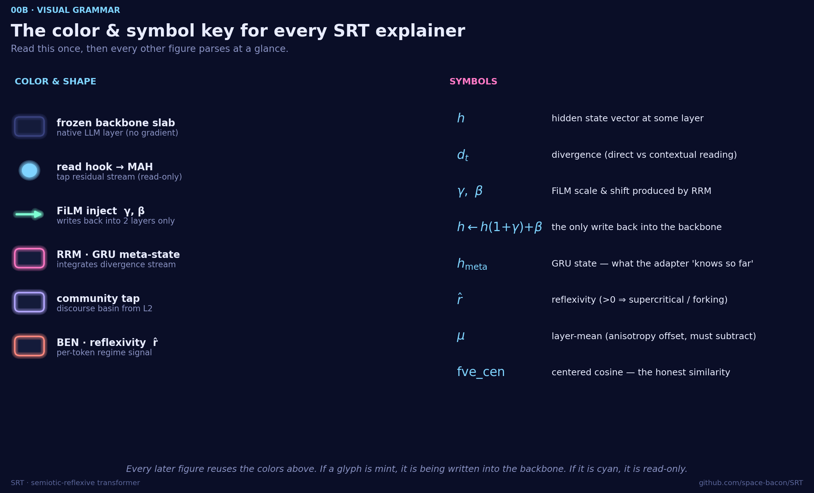
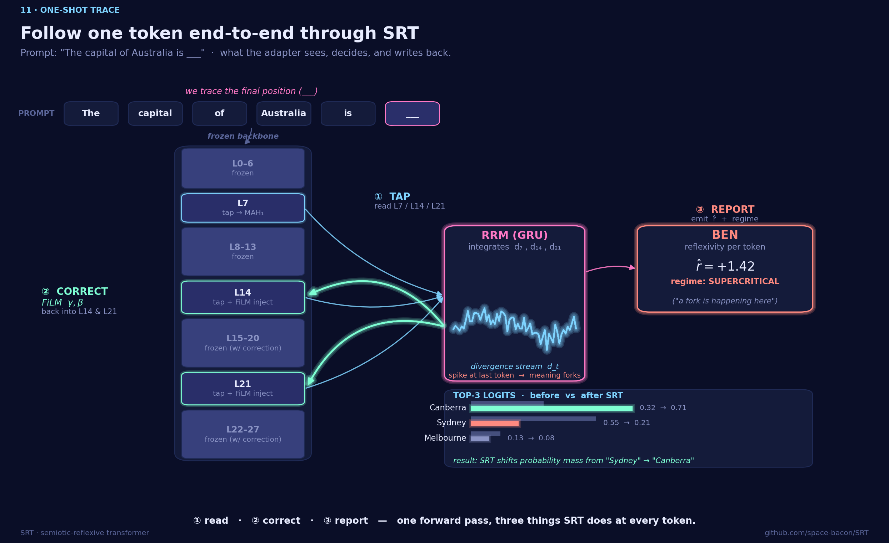

# SRT Explainer Series

A visual walkthrough of the **Semiotic-Reflexive Transformer (SRT)** —
a ~12 M-parameter adapter that observes a frozen LLM at three layers and
injects a learned correction back into two of them. Each figure is paired
with a short caption so it can be dropped into the README, the paper, or a
demo deck without rewriting context.

All visuals are PNG, 2400 × 1350 @ 150 dpi, dark navy / pastel-neon theme.

## Read this in 60 seconds

> SRT does three things at every token, in one forward pass:
>
> 1. **Read.** Tap the residual stream at L7, L14, L21. Compare each token's *direct* reading of its hidden state to its *contextual* reading. The gap is a **divergence vector** — a measure of how much the meaning is forking.
> 2. **Correct.** Stream those divergences into a small GRU (the RRM). It emits `γ, β` and FiLM-injects them back at L14 and L21: `h ← h·(1+γ) + β`. The base model's weights never change.
> 3. **Report.** BEN reads the GRU's state to emit a per-token **reflexivity** `r̂` and a regime label (sub- vs super-critical). This is the signal we use downstream — e.g. as TruthfulQA features.
>
> About 12 M trainable params (≈0.17 % of a 7 B backbone). Works on Qwen-2.5-7B, Llama-3.2-3B, Gemma-2-2B with one harness.

## Three reading paths

| time   | path                                                                                                  | for                       |
|--------|-------------------------------------------------------------------------------------------------------|---------------------------|
| 5 min  | [00 → 00b → 11 → 08](#00--architecture--what-attaches-to-the-frozen-llm)                              | curious newcomer          |
| 15 min | [00 → 00b → 01 → 03 → 04 → 05 → 11 → 08](#00--architecture--what-attaches-to-the-frozen-llm)          | researcher / reviewer     |
| full   | all sections in order                                                                                 | implementer / contributor |

## Visual grammar — read once, then every figure parses at a glance



If a glyph is **mint**, the adapter is writing back into the backbone.
If it is **cyan**, it is read-only. **Magenta** is the RRM / meta-state,
**violet** is community, **coral** is BEN, the dim slabs are the frozen LLM.

## Glossary

| symbol / term      | meaning                                                                                |
|--------------------|----------------------------------------------------------------------------------------|
| **frozen backbone**| the base LLM (Qwen / Llama / Gemma). No gradient flows into it. Ever.                  |
| **residual stream**| per-token hidden-state vector after each transformer layer.                            |
| **hook / tap**     | a read-only handle on the residual stream at a specific layer.                         |
| `h`                | hidden state vector at some layer.                                                     |
| `d_t`              | divergence — gap between direct and contextual reading of `h_t` (MAH output).          |
| **MAH**            | Metapragmatic Attention Heads — compute `d_t` at L7/L14/L21.                           |
| **RRM**            | Reflexive-Reasoning Module — GRU that integrates the `d_t` stream into `h_meta`.       |
| `h_meta`           | the GRU's hidden state — what the adapter "knows so far" about the sentence.           |
| `γ, β`             | FiLM scale & shift produced by RRM, applied per token.                                 |
| **FiLM**           | feature-wise linear modulation: `h ← h·(1+γ) + β`. The only write back into the LLM.   |
| **BEN**            | Bifurcation-Estimation Network — turns `h_meta` into reflexivity + regime label.       |
| `r̂`               | reflexivity (per token). `> 0` ⇒ supercritical / forking, `≤ 0` ⇒ subcritical / stable.|
| **Community**      | a head at L2 that emits a discourse-basin coordinate (topic / register).               |
| `μ`                | layer-mean (anisotropy offset). Subtract it before measuring cosine similarity.        |
| `fve_cen`          | centered cosine similarity — the only honest comparison metric for hidden states.      |

## Figure index

| #   | Figure                          | Section                                                               |
|-----|---------------------------------|-----------------------------------------------------------------------|
| 00  | Architecture (README hero)      | [→](#00--architecture--what-attaches-to-the-frozen-llm)               |
| 00b | Visual grammar (color/symbol key)| [→](#00b--visual-grammar--color-and-symbol-key)                      |
| 01  | Pipeline overview               | [→](#01--how-srt-reads-and-corrects-a-frozen-llm)                     |
| 02  | Anisotropy collapse             | [→](#02--anisotropy-collapse--why-raw-cosine-lies)                    |
| 03  | MAH — metapragmatic attention   | [→](#03--mah--where-meaning-forks)                                    |
| 04  | RRM — reflexive memory + FiLM   | [→](#04--rrm--film-correction-back-into-the-backbone)                 |
| 05  | BEN — bifurcation estimation    | [→](#05--ben--reflexivity-per-token)                                  |
| 06  | Community — discourse basins    | [→](#06--community--discourse-basins)                                 |
| 07  | Eleven losses                   | [→](#07--the-eleven-losses-that-train-the-adapter)                    |
| 08  | TruthfulQA ladder               | [→](#08--truthfulqa-ladder)                                           |
| 09  | Cross-architecture leaderboard  | [→](#09--three-backbones-one-harness)                                 |
| 10  | Demo / script map               | [→](#10--how-the-scripts-connect)                                     |
| 11  | One-shot token trace            | [→](#11--one-shot-token-trace--follow-one-token-end-to-end)           |

---

## 00 · Architecture — what attaches to the frozen LLM


*In one picture: a frozen 28-layer LLM in the middle, three cyan read-taps on the left feeding a magenta GRU (the RRM), two mint write-arrows curving back into L14 and L21, and a coral BEN box on the right that reports per-token reflexivity.*

**Caption.** The hero diagram (replaces the README ASCII block). The base
LLM stays fully frozen — native embeddings, native LM head, native
attention. SRT taps L2 (community), L7, L14, L21 (MAH) and injects FiLM
corrections back into L14 and L21. The RRM is a single GRU that integrates
the divergence stream into a meta-state, which also drives BEN.

**Read this when:** you need a single picture of "what is SRT and where does it touch the backbone."

**Skip if:** you already know SRT and just want the per-module detail (jump to §03-05).

**Cross-refs:** [srt/adapter.py](../srt/adapter.py),
[srt/modules/](../srt/modules/), [srt/config.py](../srt/config.py).

---

## 00b · Visual grammar — color and symbol key


*The Rosetta stone for the rest of the series. Two columns: every color/shape on the left, every math symbol on the right.*

**Caption.** Mint = the adapter is writing back into the backbone (FiLM inject). Cyan = read-only tap. Magenta = RRM / meta-state. Violet = community. Coral = BEN / reflexivity. Dim slabs = frozen LLM layers. Symbols `h`, `d_t`, `γ, β`, `h_meta`, `r̂`, `μ`, `fve_cen` decoded once here and reused everywhere.

**Read this when:** any later figure has a color or symbol you can't place.

**Skip if:** you've internalized the palette and notation already.

---

## 01 · How SRT reads and corrects a frozen LLM


*A horizontal pipeline view: tokens flow left-to-right through 28 frozen layers, four colored hooks reach down to the adapter modules, and FiLM injections curve back up into L14 and L21. Param budget is tabulated at the bottom-right.*

**Skip if:** you've already read §00 — this is the same architecture in horizontal form.

**Caption.** SRT keeps the base LLM (Qwen-2.5-7B / Llama-3.2-3B / Gemma-2-2B)
fully frozen — no weight updates, no LoRA. It taps three observation hooks
(L2 for the discourse basin, L7/L14/L21 for metapragmatic attention) and
injects a learned FiLM correction `h ← h·(1+γ) + β` at L14 and L21. The
entire adapter is ~12 M parameters (≈0.17 % of a 7 B backbone) split across
Community (0.06 M), MAH ×3 (8.10 M), RRM (2.20 M), and BEN+chain (0.30 M).

**Read this when:** onboarding a new collaborator, or anchoring any
discussion of "what does SRT actually attach to."

**Cross-refs:** [srt/adapter.py](../srt/adapter.py),
[srt/config.py](../srt/config.py).

---

## 02 · Anisotropy collapse — why raw cosine lies


*LLMs don't put their thoughts at the origin. Plain cosine similarity therefore floats on a random floor of ≈0.62 instead of 0.5 — every similarity-based diagnostic is biased unless you subtract the layer-mean first.*

**Skip if:** you already know what `fve_cen` is and why we never report `fve_nrm`.

**Caption.** Hidden states in a trained LLM are not centered: they cluster
around a non-zero layer-mean μ whose norm varies more than 16× across
backbones (≈55 for Qwen-2.5-7B L20, ≈7.2 for Llama-3.2-3B L19, ≈3.4 for
Gemma-2-2B L18). Raw cosine therefore sits on a random floor of ≈0.62
instead of 0.5, which inflates every similarity-based diagnostic. Centering
by μ before scoring (`fve_cen`) recovers an honest geometry and is what
every SRT loss and probe operates on.

**Read this when:** explaining why we never report raw `fve_nrm` numbers,
and why the same harness can score three different backbones fairly.

**Cross-refs:** `centered_eval.py`, `compute_layer_mean.py`.

---

## 03 · MAH — where meaning forks


*Each MAH reads a token two ways — once by itself, once in context — and reports the gap. A big gap on "bank" means "finance vs river" is alive at this token. The gap vector is the only signal that feeds the rest of the adapter.*

**Skip if:** you just need to know that MAH outputs are called `d_t`.

**Caption.** Metapragmatic Attention Heads (MAH) compute two interpretants
per token: a **direct** projection of the hidden state `proj_int(h_t)` and a
**contextual** one obtained by attending over the past `attn(proj_int(h_{0..t}))`.
Their gap, projected once more, is the **divergence vector**
`d_t = proj_div(direct − contextual)`. Tokens whose two readings disagree —
here, "bank" flipping between *finance* and *river* — produce a large `‖d_t‖`
and become the signal that drives the rest of the adapter.
SRT runs three MAH heads in parallel (L7, L14, L21) at `d_sub = 512`,
`d_div = 256`, `num_heads = 4`. This is the operational form of Peirce's
*interpretant*: a sign is read in light of another sign.

**Read this when:** anyone asks "what is a divergence," "what feeds the
GRU," or "where does the semiotic framing actually live in the code."

**Cross-refs:** [srt/modules/mah.py](../srt/modules/mah.py).

---

## 04 · RRM — FiLM correction back into the backbone


*A tiny GRU watches the model think and nudges two specific layers. It starts as the identity (γ ≈ 0, β = 0) and only earns its corrections through training, so the base model is unchanged at step 0.*

**Skip if:** you already know the FiLM formula and just need the dimensions (`d_meta = 512`, inject at L14 and L21).

**Caption.** The Reflexive-Reasoning Module is a GRU (`d_meta = 512`) that
ingests the stream of MAH divergences `d_t` and emits a pair of vectors —
`γ_t` (multiplicative) and `β_t` (additive). These are projected into the
backbone's hidden width and applied as a FiLM transform at L14 and L21:
`h' = h·(1+γ) + β`. The projections initialize so that `γ ≈ 0` and `β = 0`,
meaning the adapter starts as the identity and only *earns* its corrections
through training. This is the only place where SRT writes back into the
frozen LLM.

**Read this when:** explaining why training is stable from step 0, or how
SRT changes the forward pass without unfreezing the base model.

**Cross-refs:** [srt/modules/rrm.py](../srt/modules/rrm.py),
[srt/adapter.py](../srt/adapter.py).

---

## 05 · BEN — reflexivity per token


*BEN turns the GRU's running state into a single number per token — "is meaning forking here, or holding stable?" — plus a hard regime label. This is the per-token signal the heatmaps visualize and the TruthfulQA features consume.*

**Skip if:** you only care about the downstream feature (it's `r̂` and a 2-way regime logit).

**Caption.** The Bifurcation-Estimation Network turns the GRU's meta-state
into a scalar **reflexivity** `r̂` per token (positive ⇒ supercritical /
bifurcating, ≤0 ⇒ subcritical / stable) plus a 2-way regime logit. Because
the raw `r` target spans many orders of magnitude, the training target is
`sign(r)·log(1+|r|)` — a smooth log-compression that maps it into a
learnable range. Four signals shape BEN: a smooth-L1 fidelity loss
(`bif_loss`, weight 1.0), a hard regime CE gate (weight 5.0), a chain
consistency MSE on the next-step divergence (weight 0.5), and a ListNet
rank-loss on `r̂` ordering within the sequence (weight 0.5).

**Read this when:** discussing what the per-token heatmap actually shows,
or why the regime gate dominates the loss weights.

**Cross-refs:** [srt/modules/ben.py](../srt/modules/ben.py),
[srt/training/losses.py](../srt/training/losses.py).

---

## 06 · Community — discourse basins


*A second, lower tap (L2) answers a different question: "what kind of text is this?" — news, code, poetry, dialogue. Every other module conditions on it.*

**Skip if:** you've already absorbed that v8a uses a continuous 64-D community vector (older v3-v7 used 32 prototypes).

**Caption.** A small head reads the L2 pooled hidden state and emits a
**discourse coordinate** that captures topic / register (news, code, poetry,
dialogue, instructions, …). v8a (current) uses a *continuous* 64-D vector
trained with SupCon; v3-v7 used a soft mixture over 32 learned prototypes
(`vec = softmax(enc · Pᵀ / τ) · P`). The continuous variant is the more
robust signal and is what every downstream module conditions on.

**Read this when:** explaining why pre-v8 numbers used prototype clustering,
or how SRT separates "what kind of text is this" from "where does this token
fork in meaning."

**Cross-refs:** [srt/modules/community.py](../srt/modules/community.py).

---

## 07 · The eleven losses that train the adapter


*Eleven training signals split across four jobs: predict (next-token CE), shape geometry (SupCon), enforce honesty/regime (BEN losses), and stabilize (chain residual, listnet, div-alive). CE and the regime gate dominate.*

**Skip if:** you don't plan to retrain — at inference time none of this matters.

**Caption.** SRT's objective is the weighted sum
`Σ = w_ce·CE + w_chain·chain + w_bif·bif + …`. Backbone CE on next-token
prediction (weight 1.0) is the dominant signal; the regime gate sits at 5.0
because it is the hardest binary to learn. Community SupCon (2.0) keeps
discourse clusters apart, divergence SupCon (1.0) keeps interpretants from
collapsing, and a long tail of small auxiliaries (`chain`, `listnet`,
`div-alive`, `chain-residual`, `community-entropy`) shape the chain of
divergences. `inject-reg` is disabled from v4 onward.

**Read this when:** anyone asks "what is SRT optimizing," "why is the regime
weight so high," or "what changed between v3 and v4."

**Cross-refs:** [srt/training/losses.py](../srt/training/losses.py),
[srt/config.py](../srt/config.py).

---

## 08 · TruthfulQA ladder


*The headline result, told as a ladder: one bar per design decision, from "a single naïve feature" (0.535 AUC) up to "the full SRT feature union under LightGBM" (0.866). Every rung is an isolated change.*

**Skip if:** you just want the top number — `0.866 ± 0.011` group-CV AUC on Qwen-2.5-7B.

**Caption.** A single test-set ladder showing how each design change
moves TruthfulQA-MC2 group-CV AUC from 0.535 (single-feature NLL margin) to
**0.866 ± 0.011** with the v3 LightGBM head on the full 320-feature union.
The classifier-head comparison panel makes the case for the gradient-boosted
union: LightGBM ≈ logistic-regression union ≈ 0.86, well above any single
SRT feature family.

**Read this when:** defending the headline TruthfulQA number, or showing
the marginal value of each feature family.

**Cross-refs:** [docs/TRUTHFULQA_RESULTS.md](TRUTHFULQA_RESULTS.md),
`evals/truthfulqa_v3.py`.

---

## 09 · Three backbones, one harness


*Per-family ablations on Qwen, Llama, Gemma. The single best feature family is backbone-specific, but the full union converges into a tight 0.848-0.866 band — SRT is measuring something architecture-portable, not a Qwen artifact.*

**Skip if:** you only care that Qwen-2.5-7B hits 0.866 and the spread across the other two is ≤0.02.

**Caption.** Same evaluation harness, three different frozen backbones, six
ablated feature families. The single best family is **backbone-dependent**:
Qwen leans on norm (0.769) and interactions (0.765), Llama leans on drift
(0.736), Gemma leans on attention (0.755). But once the full union is fed to
a LightGBM head, all three converge into a tight band — **0.848-0.866** —
demonstrating that SRT measures something architecture-portable rather than
something Qwen-shaped.

**Read this when:** rebutting "your numbers are a Qwen artifact," or
introducing the cross-architecture leaderboard.

**Cross-refs:** [artifacts/benchmark_curated/metrics.json](../artifacts/benchmark_curated/metrics.json),
[docs/TRUTHFULQA_RESULTS.md](TRUTHFULQA_RESULTS.md).

---

## 10 · How the scripts connect


*The repo as a directed graph: training script → checkpoint → three intrinsic evals + one extrinsic TruthfulQA pipeline → plots and the Gradio demo. Every arrow is either a `.pt`, a JSONL trace, or a metrics JSON.*

**Skip if:** you already know which script produces which artifact.

**Caption.** Operational map of the repo: training (`scripts/train.py`)
produces a checkpoint and a JSONL log; the checkpoint feeds three intrinsic
evals (`centered_eval`, `rerank_eval`, `oracle_ceiling`) and the extrinsic
TruthfulQA pipeline (`evals/truthfulqa_v3.py`), which in turn feeds the
visual stack (`render_heatmap`, `plot_artifacts`) and the Gradio demo. Each
arrow is either a checkpoint, a JSONL trace, or a metrics JSON.

**Read this when:** onboarding to the repo, or deciding which script to run
to reproduce a specific number.

**Cross-refs:** [scripts/](../scripts/), [evals/](../evals/).

---

## 11 · One-shot token trace — follow one token end-to-end



*The single "aha" figure. A prompt enters the frozen tower at the top, three cyan taps feed the RRM, two mint arrows return as FiLM corrections, BEN emits `r̂ = +1.42` (supercritical), and the bottom panel shows the actual logit shift: "Sydney" 0.55 → 0.21, "Canberra" 0.32 → 0.71.*

**Caption.** A walk-through of one forward pass at one token position. The three callouts ①TAP / ②CORRECT / ③REPORT name the only three things SRT does, ever — at every token, in one pass, on top of a frozen backbone. Read this when the architecture diagram feels abstract.

**Read this when:** you want to *feel* what SRT does on a specific example, not just see boxes and arrows.

**Skip if:** you already grokked §00 + §00b — this figure is a worked example of the same machinery.

**Cross-refs:** [srt/adapter.py](../srt/adapter.py),
[srt/modules/rrm.py](../srt/modules/rrm.py),
[srt/modules/ben.py](../srt/modules/ben.py).

---

## FAQ

**Q: Why a frozen backbone? Doesn't fine-tuning work better?**
A frozen backbone keeps the base model's general capability intact (CE stays at pretrained quality from step 0), makes the adapter portable across checkpoints, and lets us claim that any measured improvement is *additive* rather than a fine-tune artifact. SRT is ~12 M params on a 7 B base — fine-tuning would be 580× larger and would mask the signal.

**Q: What does "reflexivity" actually mean here?**
It's a scalar `r̂` per token that estimates how much meaning is *forking* at that position. Positive ⇒ the model has multiple live interpretants competing ("supercritical"); ≤0 ⇒ the reading is stable. It's the output of BEN, trained from the divergence stream's behavior under the GRU.

**Q: Where is the only place SRT writes back into the LLM?**
Two FiLM injections, at L14 and L21: `h ← h·(1+γ) + β`. Nothing else mutates the residual stream. Everything else is read-only.

**Q: Which backbones?**
Qwen-2.5-7B, Llama-3.2-3B, Gemma-2-2B, all with the same harness. Any HuggingFace `AutoModelForCausalLM` should work — taps are by layer index, no architecture-specific hooks.

**Q: How do I reproduce these figures?**
See below.

---

## Reproducing the figures

```bash
source .venv-tools/bin/activate          # matplotlib 3.10 + numpy 2.4
python scripts/explainers/make_all.py    # writes 13 PNGs to artifacts/explainers/
```

All numbers in the figures are hard-coded from the committed artifacts under
`artifacts/benchmark_curated*/metrics.json` and the v4 defaults in
`srt/config.py`. Re-render after updating those sources.
