# SRT Explainer Series

A 10-figure walkthrough of the **Semiotic-Reflexive Transformer (SRT)** —
a ~12 M-parameter adapter that observes a frozen LLM at three layers and
injects a learned correction back into two of them. Each figure is paired
with a short caption so it can be dropped into the README, the paper, or a
demo deck without rewriting context.

All visuals are PNG, 2400 × 1350 @ 150 dpi, dark navy / pastel-neon theme.

| #  | Figure                         | Section                       |
|----|--------------------------------|-------------------------------|
| 00 | Architecture (README hero)     | [→](#00--architecture--what-attaches-to-the-frozen-llm) |
| 01 | Pipeline overview              | [→](#01--how-srt-reads-and-corrects-a-frozen-llm) |
| 02 | Anisotropy collapse            | [→](#02--anisotropy-collapse--why-raw-cosine-lies) |
| 03 | MAH — metapragmatic attention  | [→](#03--mah--where-meaning-forks) |
| 04 | RRM — reflexive memory + FiLM  | [→](#04--rrm--film-correction-back-into-the-backbone) |
| 05 | BEN — bifurcation estimation   | [→](#05--ben--reflexivity-per-token) |
| 06 | Community — discourse basins   | [→](#06--community--discourse-basins) |
| 07 | Eleven losses                  | [→](#07--the-eleven-losses-that-train-the-adapter) |
| 08 | TruthfulQA ladder              | [→](#08--truthfulqa-ladder) |
| 09 | Cross-architecture leaderboard | [→](#09--three-backbones-one-harness) |
| 10 | Demo / script map              | [→](#10--how-the-scripts-connect) |

---

## 00 · Architecture — what attaches to the frozen LLM

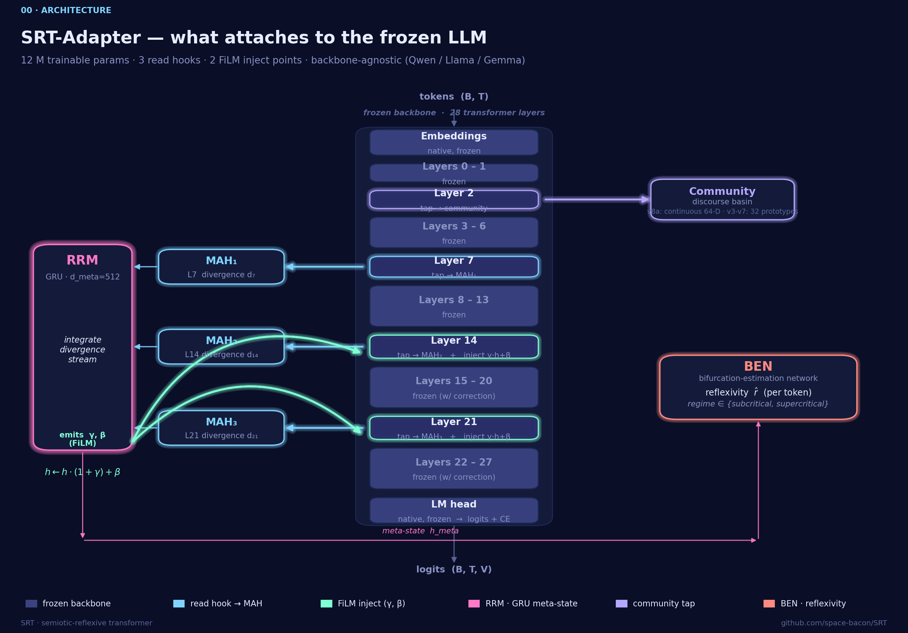

**Caption.** The hero diagram (replaces the README ASCII block). The base
LLM stays fully frozen — native embeddings, native LM head, native
attention. SRT taps L2 (community), L7, L14, L21 (MAH) and injects FiLM
corrections back into L14 and L21. The RRM is a single GRU that integrates
the divergence stream into a meta-state, which also drives BEN.

**Read this when:** you need a single picture of "what is SRT and where
does it touch the backbone."

**Cross-refs:** [srt/adapter.py](../srt/adapter.py),
[srt/modules/](../srt/modules/), [srt/config.py](../srt/config.py).

---

## 01 · How SRT reads and corrects a frozen LLM

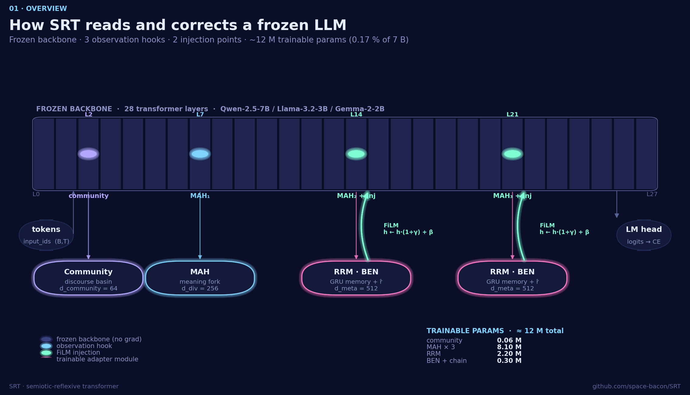

**Caption.** SRT keeps the base LLM (Qwen-2.5-7B / Llama-3.2-3B / Gemma-2-2B)
fully frozen — no weight updates, no LoRA. It taps three observation hooks
(L2 for the discourse basin, L7/L14/L21 for metapragmatic attention) and
injects a learned FiLM correction `h ← h·(1+γ) + β` at L14 and L21. The
entire adapter is ~12 M parameters (≈0.17 % of a 7 B backbone) split across
Community (0.06 M), MAH ×3 (8.10 M), RRM (2.20 M), and BEN+chain (0.30 M).

**Read this when:** onboarding a new collaborator, or anchoring any
discussion of "what does SRT actually attach to."

**Cross-refs:** [srt/adapter.py](../srt/adapter.py),
[srt/config.py](../srt/config.py).

---

## 02 · Anisotropy collapse — why raw cosine lies

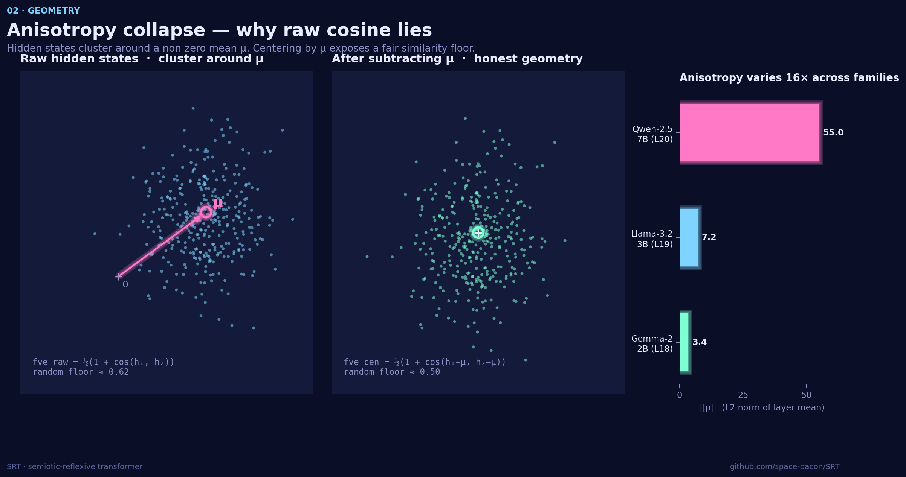

**Caption.** Hidden states in a trained LLM are not centered: they cluster
around a non-zero layer-mean μ whose norm varies more than 16× across
backbones (≈55 for Qwen-2.5-7B L20, ≈7.2 for Llama-3.2-3B L19, ≈3.4 for
Gemma-2-2B L18). Raw cosine therefore sits on a random floor of ≈0.62
instead of 0.5, which inflates every similarity-based diagnostic. Centering
by μ before scoring (`fve_cen`) recovers an honest geometry and is what
every SRT loss and probe operates on.

**Read this when:** explaining why we never report raw `fve_nrm` numbers,
and why the same harness can score three different backbones fairly.

**Cross-refs:** `centered_eval.py`, `compute_layer_mean.py`.

---

## 03 · MAH — where meaning forks

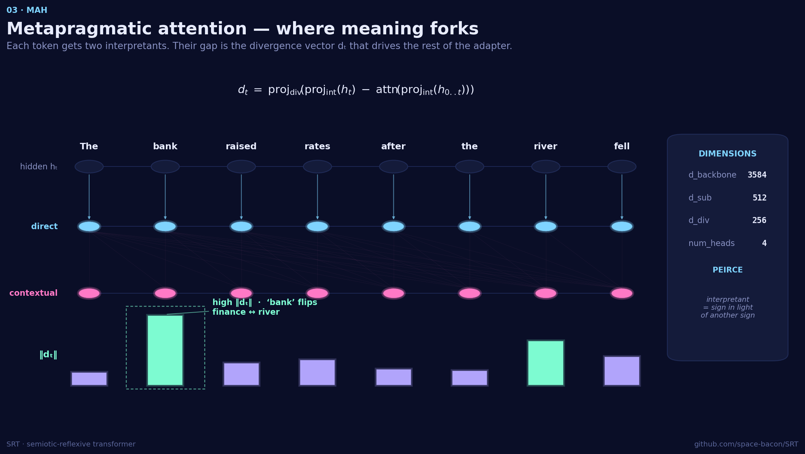

**Caption.** Metapragmatic Attention Heads (MAH) compute two interpretants
per token: a **direct** projection of the hidden state `proj_int(h_t)` and a
**contextual** one obtained by attending over the past `attn(proj_int(h_{0..t}))`.
Their gap, projected once more, is the **divergence vector**
`d_t = proj_div(direct − contextual)`. Tokens whose two readings disagree —
here, "bank" flipping between *finance* and *river* — produce a large `‖d_t‖`
and become the signal that drives the rest of the adapter.
SRT runs three MAH heads in parallel (L7, L14, L21) at `d_sub = 512`,
`d_div = 256`, `num_heads = 4`. This is the operational form of Peirce's
*interpretant*: a sign is read in light of another sign.

**Read this when:** anyone asks "what is a divergence," "what feeds the
GRU," or "where does the semiotic framing actually live in the code."

**Cross-refs:** [srt/modules/mah.py](../srt/modules/mah.py).

---

## 04 · RRM — FiLM correction back into the backbone

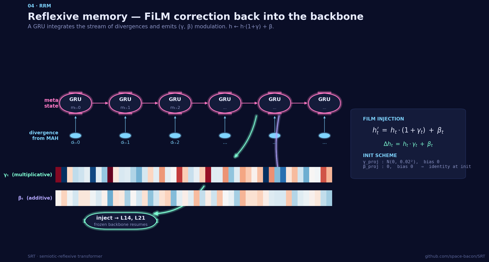

**Caption.** The Reflexive-Reasoning Module is a GRU (`d_meta = 512`) that
ingests the stream of MAH divergences `d_t` and emits a pair of vectors —
`γ_t` (multiplicative) and `β_t` (additive). These are projected into the
backbone's hidden width and applied as a FiLM transform at L14 and L21:
`h' = h·(1+γ) + β`. The projections initialize so that `γ ≈ 0` and `β = 0`,
meaning the adapter starts as the identity and only *earns* its corrections
through training. This is the only place where SRT writes back into the
frozen LLM.

**Read this when:** explaining why training is stable from step 0, or how
SRT changes the forward pass without unfreezing the base model.

**Cross-refs:** [srt/modules/rrm.py](../srt/modules/rrm.py),
[srt/adapter.py](../srt/adapter.py).

---

## 05 · BEN — reflexivity per token

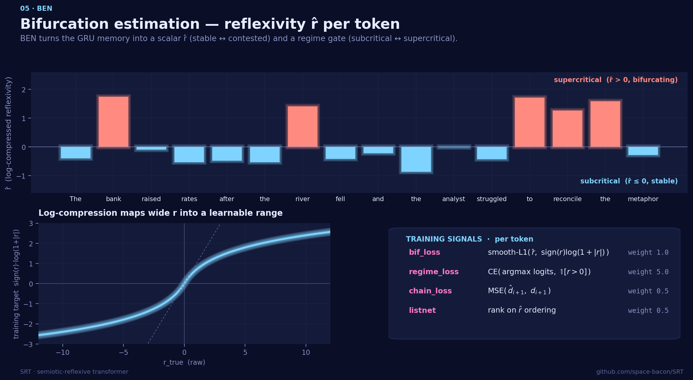

**Caption.** The Bifurcation-Estimation Network turns the GRU's meta-state
into a scalar **reflexivity** `r̂` per token (positive ⇒ supercritical /
bifurcating, ≤0 ⇒ subcritical / stable) plus a 2-way regime logit. Because
the raw `r` target spans many orders of magnitude, the training target is
`sign(r)·log(1+|r|)` — a smooth log-compression that maps it into a
learnable range. Four signals shape BEN: a smooth-L1 fidelity loss
(`bif_loss`, weight 1.0), a hard regime CE gate (weight 5.0), a chain
consistency MSE on the next-step divergence (weight 0.5), and a ListNet
rank-loss on `r̂` ordering within the sequence (weight 0.5).

**Read this when:** discussing what the per-token heatmap actually shows,
or why the regime gate dominates the loss weights.

**Cross-refs:** [srt/modules/ben.py](../srt/modules/ben.py),
[srt/training/losses.py](../srt/training/losses.py).

---

## 06 · Community — discourse basins

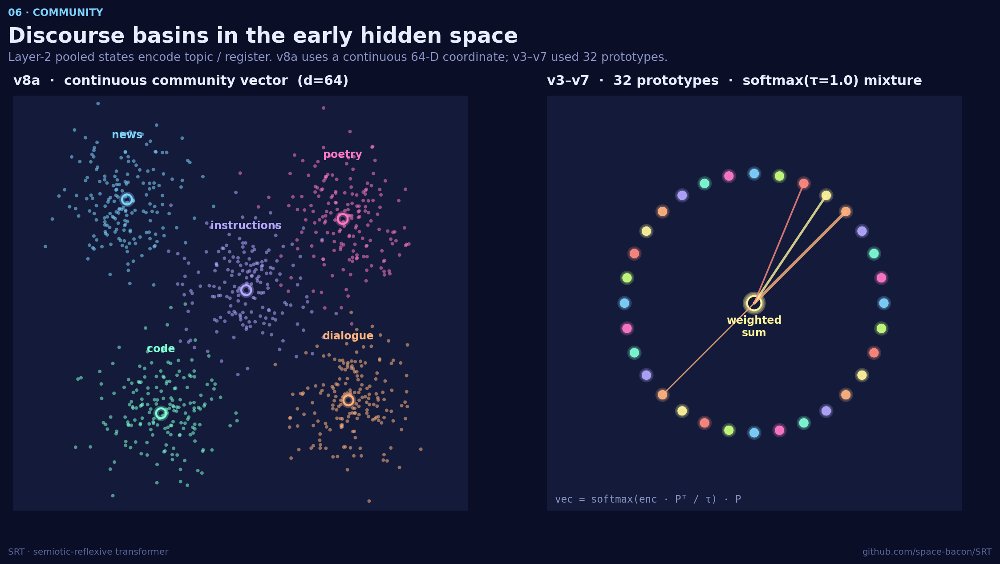

**Caption.** A small head reads the L2 pooled hidden state and emits a
**discourse coordinate** that captures topic / register (news, code, poetry,
dialogue, instructions, …). v8a (current) uses a *continuous* 64-D vector
trained with SupCon; v3-v7 used a soft mixture over 32 learned prototypes
(`vec = softmax(enc · Pᵀ / τ) · P`). The continuous variant is the more
robust signal and is what every downstream module conditions on.

**Read this when:** explaining why pre-v8 numbers used prototype clustering,
or how SRT separates "what kind of text is this" from "where does this token
fork in meaning."

**Cross-refs:** [srt/modules/community.py](../srt/modules/community.py).

---

## 07 · The eleven losses that train the adapter

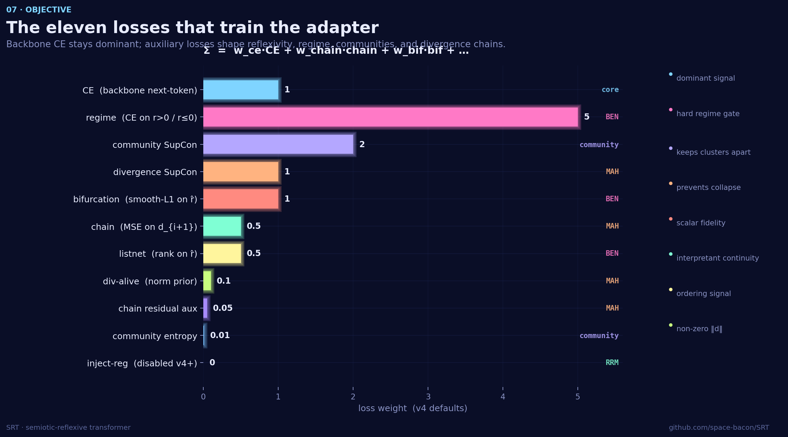

**Caption.** SRT's objective is the weighted sum
`Σ = w_ce·CE + w_chain·chain + w_bif·bif + …`. Backbone CE on next-token
prediction (weight 1.0) is the dominant signal; the regime gate sits at 5.0
because it is the hardest binary to learn. Community SupCon (2.0) keeps
discourse clusters apart, divergence SupCon (1.0) keeps interpretants from
collapsing, and a long tail of small auxiliaries (`chain`, `listnet`,
`div-alive`, `chain-residual`, `community-entropy`) shape the chain of
divergences. `inject-reg` is disabled from v4 onward.

**Read this when:** anyone asks "what is SRT optimizing," "why is the regime
weight so high," or "what changed between v3 and v4."

**Cross-refs:** [srt/training/losses.py](../srt/training/losses.py),
[srt/config.py](../srt/config.py).

---

## 08 · TruthfulQA ladder

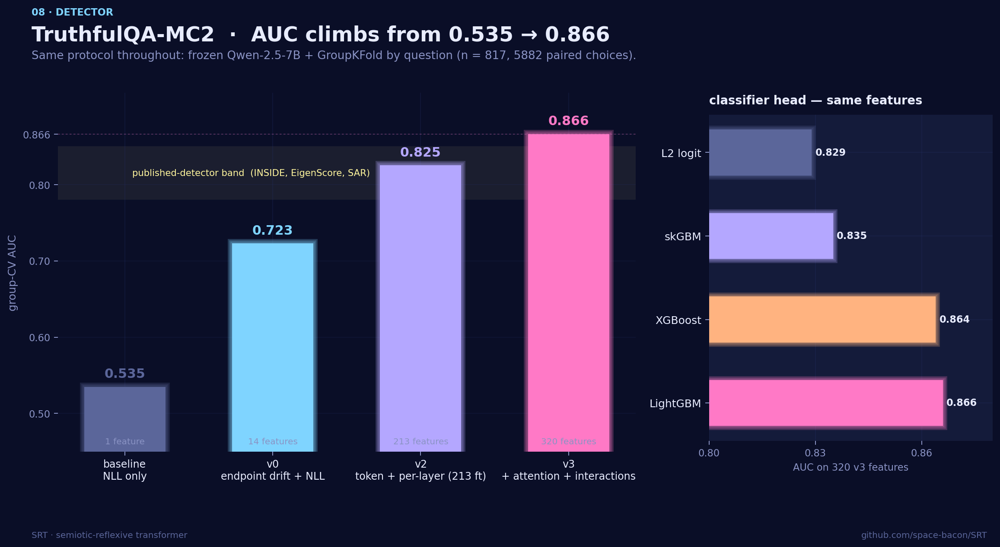

**Caption.** A single test-set ladder showing how each design change
moves TruthfulQA-MC2 group-CV AUC from 0.535 (single-feature NLL margin) to
**0.866 ± 0.011** with the v3 LightGBM head on the full 320-feature union.
The classifier-head comparison panel makes the case for the gradient-boosted
union: LightGBM ≈ logistic-regression union ≈ 0.86, well above any single
SRT feature family.

**Read this when:** defending the headline TruthfulQA number, or showing
the marginal value of each feature family.

**Cross-refs:** [docs/TRUTHFULQA_RESULTS.md](TRUTHFULQA_RESULTS.md),
`evals/truthfulqa_v3.py`.

---

## 09 · Three backbones, one harness

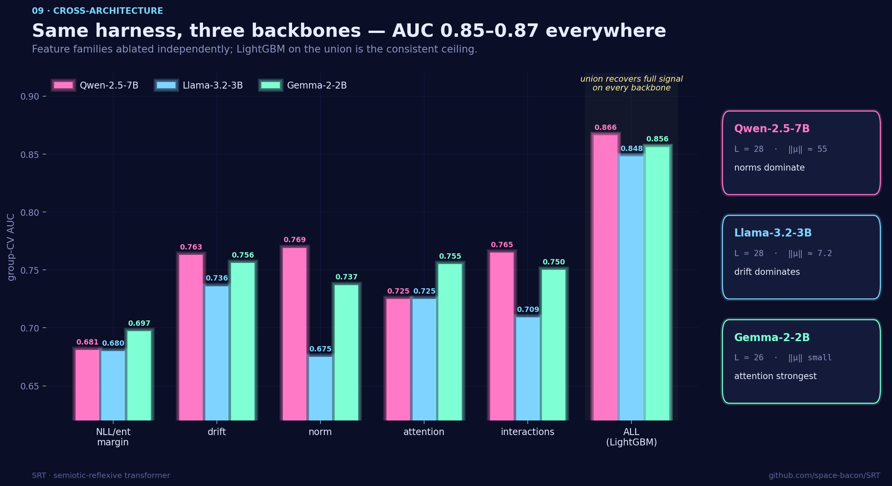

**Caption.** Same evaluation harness, three different frozen backbones, six
ablated feature families. The single best family is **backbone-dependent**:
Qwen leans on norm (0.769) and interactions (0.765), Llama leans on drift
(0.736), Gemma leans on attention (0.755). But once the full union is fed to
a LightGBM head, all three converge into a tight band — **0.848-0.866** —
demonstrating that SRT measures something architecture-portable rather than
something Qwen-shaped.

**Read this when:** rebutting "your numbers are a Qwen artifact," or
introducing the cross-architecture leaderboard.

**Cross-refs:** [artifacts/benchmark_curated/metrics.json](../artifacts/benchmark_curated/metrics.json),
[docs/TRUTHFULQA_RESULTS.md](TRUTHFULQA_RESULTS.md).

---

## 10 · How the scripts connect

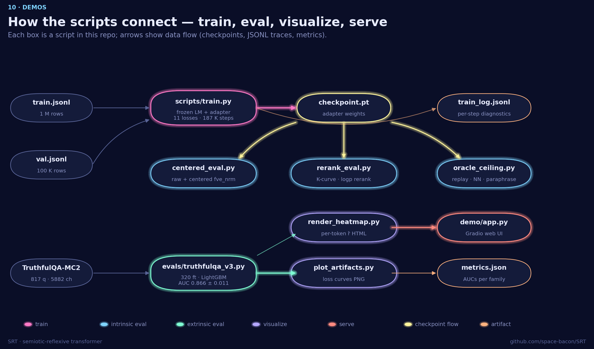

**Caption.** Operational map of the repo: training (`scripts/train.py`)
produces a checkpoint and a JSONL log; the checkpoint feeds three intrinsic
evals (`centered_eval`, `rerank_eval`, `oracle_ceiling`) and the extrinsic
TruthfulQA pipeline (`evals/truthfulqa_v3.py`), which in turn feeds the
visual stack (`render_heatmap`, `plot_artifacts`) and the Gradio demo. Each
arrow is either a checkpoint, a JSONL trace, or a metrics JSON.

**Read this when:** onboarding to the repo, or deciding which script to run
to reproduce a specific number.

**Cross-refs:** [scripts/](../scripts/), [evals/](../evals/).

---

## Reproducing the figures

```bash
source .venv-tools/bin/activate          # matplotlib 3.10 + numpy 2.4
python scripts/explainers/make_all.py    # writes 10 PNGs to artifacts/explainers/
```

All numbers in the figures are hard-coded from the committed artifacts under
`artifacts/benchmark_curated*/metrics.json` and the v4 defaults in
`srt/config.py`. Re-render after updating those sources.
